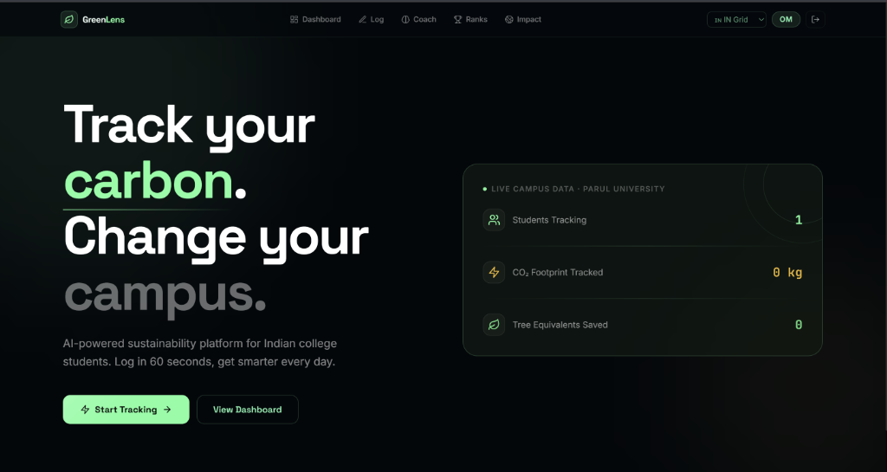
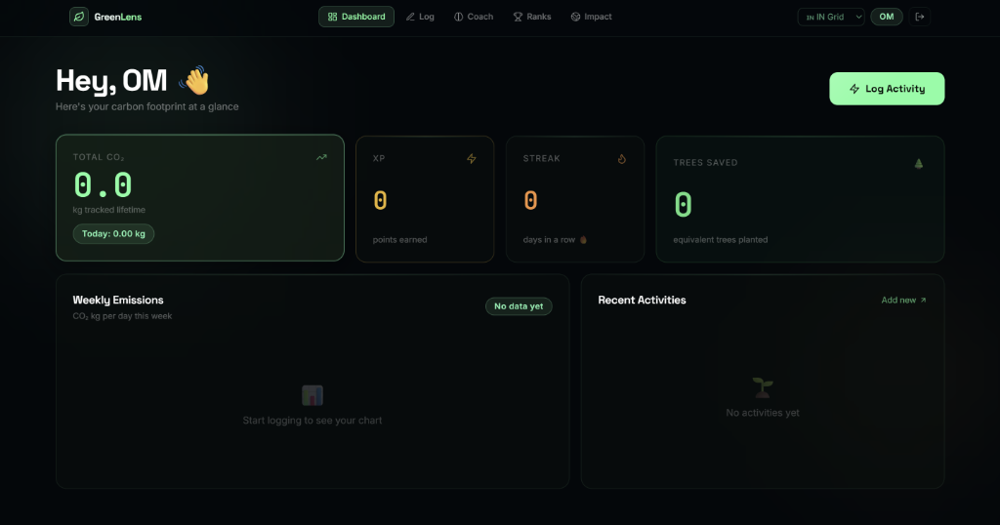
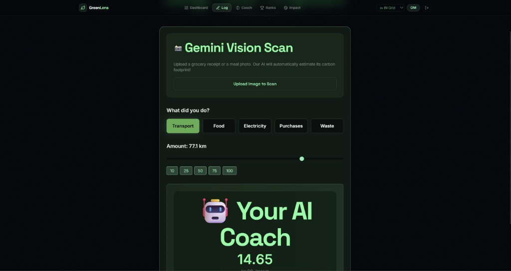
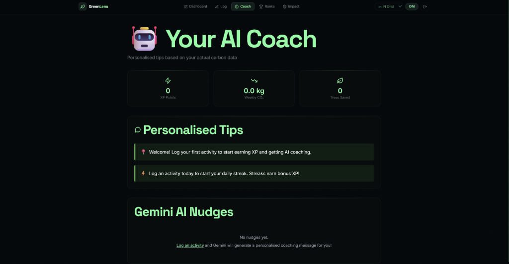
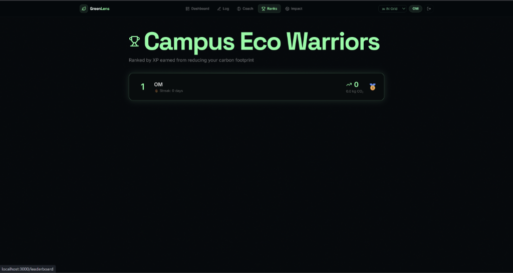

# 🌿 GreenLens - AI-Powered Carbon Tracking Platform

**Smart & Digital Innovation | Sustainability Hackathon 2026 | Parul University**

> _Track Your Carbon. Change Your Campus._

A production-grade AI-powered sustainability platform built for Indian college students to understand, track, and reduce their personal carbon footprint.

### 🌐 Live Production Application
* **Frontend UI (Vercel):** [https://green-lens-tau.vercel.app](https://green-lens-tau.vercel.app/)
* **Backend API (Render):** [https://greenlens-backend-n3ws.onrender.com](https://greenlens-backend-n3ws.onrender.com/)

---

## 📋 Table of Contents

- [Application Preview](#-application-preview)
- [Quick Start](#-quick-start)
- [Project Structure](#-project-structure)
- [Features](#-features)
- [Tech Stack](#-tech-stack)
- [Setup Instructions](#-setup-instructions)
- [Deployment](#-deployment)
- [API Documentation](#-api-documentation)
- [Architecture](#-architecture)
- [Team](#-team)

---

## 📸 Application Preview

### 🏠 Homepage


### 📊 Personal Dashboard


### 📝 Activity Logging (Gemini Vision Scan)


### 🤖 Personal AI Coach


### 🏆 Campus Leaderboard


---

## ⚡ Quick Start

### Prerequisites

- Python 3.11+
- Node.js 18+
- PostgreSQL 14+ (or Docker)
- Git

### 5-Minute Local Setup

**1. Clone & Navigate**

```bash
git clone <your-repo-url>
cd GreenLens
```

**2. Backend Setup**

```bash
cd backend
pip install -r requirements.txt
copy .env.example .env
python main.py
```

**3. PostgreSQL (Another Terminal)**

```bash
# Option A: Docker
docker-compose up -d postgres

# Option B: Manual PostgreSQL
# Download from postgresql.org and create database
psql -U postgres
CREATE DATABASE greenlens;
```

**4. Frontend Setup (Third Terminal)**

```bash
cd frontend
npm install
npm run dev
```

**5. Access Application**

- Frontend: http://localhost:3000
- Backend API: http://localhost:8000
- API Docs: http://localhost:8000/docs

---

## 📂 Project Structure

```
GreenLens/
├── backend/                      # FastAPI + PostgreSQL backend
│   ├── main.py                  # Main FastAPI application (15+ endpoints)
│   ├── models.py                # SQLAlchemy ORM models (6 tables)
│   ├── schemas.py               # Pydantic validation schemas
│   ├── auth.py                  # JWT + bcrypt authentication
│   ├── database.py              # PostgreSQL connection setup
│   ├── config.py                # Environment configuration
│   ├── emission_factors.py      # CO2 calculation engine
│   ├── gemini_nudges.py         # Google Gemini AI integration
│   ├── requirements.txt          # Python dependencies
│   ├── Dockerfile               # Container configuration
│   ├── .env.example             # Environment variables template
│   ├── .gitignore               # Git exclusions
│   └── README.md                # Backend documentation
│
├── frontend/                     # React + Vite frontend
│   ├── src/
│   │   ├── App.jsx              # Main app router
│   │   ├── main.jsx             # React entry point
│   │   ├── AuthContext.jsx      # Authentication state management
│   │   ├── ProtectedRoute.jsx   # Route protection
│   │   ├── api.js               # Axios API client
│   │   ├── index.css            # Global styles + animations
│   │   │
│   │   ├── pages/               # 6 complete pages
│   │   │   ├── HomePage.jsx         # Home with live CO₂ counter
│   │   │   ├── AuthPages.jsx        # Login & Register
│   │   │   ├── DashboardPage.jsx    # Personal stats & charts
│   │   │   ├── LogPage.jsx          # Activity logger
│   │   │   ├── CoachPage.jsx        # AI nudges
│   │   │   ├── LeaderboardPage.jsx  # Campus rankings
│   │   │   └── ImpactPage.jsx       # 30-day journey
│   │   │
│   │   └── components/          # Reusable components
│   │       └── Navbar.jsx       # Navigation
│   │
│   ├── index.html               # HTML entry point
│   ├── package.json             # Node dependencies
│   ├── vite.config.js           # Vite bundler config
│   ├── tailwind.config.js       # Tailwind CSS config
│   ├── postcss.config.js        # PostCSS config
│   ├── Dockerfile               # Container configuration
│   ├── .env.example             # Environment template
│   ├── .gitignore               # Git exclusions
│   └── README.md                # Frontend documentation
│
├── docker-compose.yml           # Local development environment
├── QUICKSTART.md                # 5-minute setup guide
├── DEPLOYMENT.md                # Production deployment guide
├── PROJECT_SUMMARY.md           # Detailed project overview
├── START_HERE.txt               # Visual project summary
├── .gitignore                   # Root git exclusions
└── README.md                    # This file

```

---

## ✨ Features

### 🔐 Authentication

- User registration with email validation
- Secure JWT-based login
- bcrypt password hashing
- Protected API endpoints
- Session management

### 📊 Activity Logging

- **5 Activity Categories:**
  - Transport (car, bike, bus, metro, flight)
  - Food (vegetarian, non-vegetarian, vegan, dairy, meat)
  - Electricity (kWh with Indian grid intensity)
  - Purchases (clothing, electronics, household)
  - Waste (plastic, paper, organic)

- **Real-time CO₂ Calculation** using Indian emission factors
- Activity history & trends
- Personal activity timeline

### 🎮 Gamification

- XP points system (10 points per kg CO₂)
- Daily streaks tracking
- Campus-wide leaderboard
- 🥇 Gold/Silver/Bronze badges (top 3)
- Trees saved equivalent calculation

### 🤖 AI Features

- **Google Gemini 1.5 Flash** integration
- Personalized daily nudges
- Context-aware recommendations
- Fallback nudges when API unavailable
- Conversational AI coach interface

### 📈 Dashboard

- Personal carbon statistics
- Weekly emission charts (Recharts)
- Activity breakdown by category
- Recent activities timeline
- Campus-wide impact metrics

### 🌍 Social Features

- Anonymous campus leaderboard
- Community impact tracking
- 30-day sustainability journey
- Aggregate campus statistics
- Weekly winner announcements

---

## 🛠️ Tech Stack

### Backend

| Technology           | Purpose            | Version |
| -------------------- | ------------------ | ------- |
| FastAPI              | Web framework      | 0.104   |
| Uvicorn              | ASGI server        | 0.24    |
| SQLAlchemy           | ORM                | 2.0     |
| PostgreSQL           | Database           | 15      |
| Pydantic             | Data validation    | 2.5     |
| PyJWT                | JWT authentication | 3.3     |
| bcrypt               | Password hashing   | 4.1     |
| Google Generative AI | AI nudges          | 0.3     |
| Python-Jose          | Token handling     | 3.3     |

### Frontend

| Technology   | Purpose            | Version |
| ------------ | ------------------ | ------- |
| React        | UI framework       | 18.2    |
| Vite         | Module bundler     | 5.0     |
| React Router | Client routing     | 6.20    |
| Tailwind CSS | Styling            | 3.3     |
| Recharts     | Data visualization | 2.10    |
| Lucide       | Icons              | 0.294   |
| Axios        | HTTP client        | 1.6     |
| PostCSS      | CSS processing     | 8.4     |

### DevOps

| Technology     | Purpose               |
| -------------- | --------------------- |
| Docker         | Containerization      |
| Docker Compose | Multi-container setup |
| PostgreSQL     | Database              |

---

## 🚀 Setup Instructions

### Local Development

**Step 1: Install Dependencies**

```bash
# Backend
cd backend
pip install -r requirements.txt

# Frontend
cd ../frontend
npm install
```

**Step 2: Configure Environment**

```bash
# Backend
cd ../backend
copy .env.example .env
# Edit .env and add:
# - DATABASE_URL (PostgreSQL connection)
# - SECRET_KEY (random 32+ char string)
# - GEMINI_API_KEY (optional, for AI nudges)

# Frontend
cd ../frontend
copy .env.example .env
# VITE_API_URL=http://localhost:8000
```

**Step 3: Set Up Database**

**Option A: Using Docker (Recommended)**

```bash
cd ..
docker-compose up -d postgres
# Wait 10 seconds for PostgreSQL to start
```

**Option B: Manual PostgreSQL**

```bash
# Download from https://www.postgresql.org/download/windows/
# After installation:
psql -U postgres
CREATE DATABASE greenlens;
\q
```

**Step 4: Run Applications**

```bash
# Terminal 1 - Backend
cd backend
python main.py
# Server running at http://localhost:8000

# Terminal 2 - Frontend
cd frontend
npm run dev
# App running at http://localhost:3000
```

**Step 5: Test the Application**

1. Open http://localhost:3000
2. Click "Sign Up"
3. Create account (test@example.com)
4. Log activities
5. View dashboard & leaderboard

---

## 📤 Deployment

### Quick Deployment (10 minutes)

#### Option 1: Railway (Recommended)

1. Go to https://railway.app
2. Create new project
3. Add PostgreSQL plugin
4. Deploy backend service
5. Deploy frontend service
6. Share public URLs

[Full Railway Guide → See DEPLOYMENT.md]

#### Option 2: Render

1. Go to https://render.com
2. Create PostgreSQL database
3. Deploy backend web service
4. Deploy frontend static site

[Full Render Guide → See DEPLOYMENT.md]

#### Option 3: Docker + VPS

```bash
docker-compose up -d
```

[Full Docker Guide → See DEPLOYMENT.md]

### Production Checklist

- [ ] Set strong `SECRET_KEY` (32+ random chars)
- [ ] Configure `GEMINI_API_KEY` (optional)
- [ ] Use managed PostgreSQL (don't expose credentials)
- [ ] Enable HTTPS
- [ ] Set up monitoring & logs
- [ ] Configure email notifications (future)
- [ ] Review security headers
- [ ] Test all API endpoints
- [ ] Load test the application

---

## 📡 API Documentation

### Base URL

```
http://localhost:8000  (local)
https://your-api.railway.app  (production)
```

### Authentication Endpoints

| Method | Endpoint             | Purpose            |
| ------ | -------------------- | ------------------ |
| POST   | `/api/auth/register` | Create new account |
| POST   | `/api/auth/login`    | Get JWT token      |

### Activity Endpoints

| Method | Endpoint          | Purpose             |
| ------ | ----------------- | ------------------- |
| POST   | `/api/activities` | Log new activity    |
| GET    | `/api/activities` | Get user activities |

### Stats Endpoints

| Method | Endpoint            | Purpose            |
| ------ | ------------------- | ------------------ |
| GET    | `/api/user/profile` | Get user details   |
| GET    | `/api/stats`        | Get personal stats |
| GET    | `/api/dashboard`    | Get full dashboard |

### Social Endpoints

| Method | Endpoint           | Purpose             |
| ------ | ------------------ | ------------------- |
| GET    | `/api/leaderboard` | Get campus rankings |
| GET    | `/api/nudges`      | Get AI nudges       |
| PUT    | `/api/nudges/{id}` | Mark nudge read     |

### Campus Endpoints

| Method | Endpoint            | Purpose              |
| ------ | ------------------- | -------------------- |
| GET    | `/api/campus-stats` | Get aggregate impact |

### Full API Docs

- **Swagger UI**: http://localhost:8000/docs
- **ReDoc**: http://localhost:8000/redoc

---

## 🏗️ Architecture

### System Design

```
┌─────────────────────────────────────────────────────────────┐
│                        Frontend (React)                      │
│  ┌──────────────┬──────────────┬────────────────────────┐   │
│  │ Home Page    │ Dashboard    │ Activity Logger        │   │
│  │ Auth Pages   │ Leaderboard  │ AI Coach              │   │
│  │ Impact Page  │              │                        │   │
│  └──────────────┴──────────────┴────────────────────────┘   │
│            ↓ HTTP/REST with JWT Bearer Token ↓              │
├─────────────────────────────────────────────────────────────┤
│                    Backend API (FastAPI)                     │
│  ┌──────────────────────────────────────────────────────┐   │
│  │ Authentication │ Activities │ Stats │ Leaderboard     │   │
│  │ CO₂ Calculator │ AI Nudges  │ Realtime Updates     │   │
│  └──────────────────────────────────────────────────────┘   │
│              ↓ SQLAlchemy ORM with Connection Pooling ↓    │
├─────────────────────────────────────────────────────────────┤
│                 PostgreSQL Database                          │
│  ┌──────────────────────────────────────────────────────┐   │
│  │ Users │ Activities │ Stats │ Leaderboard │ Nudges   │   │
│  └──────────────────────────────────────────────────────┘   │
│              ↓ External Services ↓                          │
├─────────────────────────────────────────────────────────────┤
│ Google Gemini 1.5 Flash (AI Nudge Generation)               │
└─────────────────────────────────────────────────────────────┘
```

### Data Flow

1. **User Registration** → FastAPI validates → Bcrypt hashes password → Stores in PostgreSQL
2. **Login** → FastAPI verifies credentials → Issues JWT token → Frontend stores in localStorage
3. **Log Activity** → Frontend sends to API with JWT → FastAPI validates & calculates CO₂ → Stores in DB → Generates AI nudge
4. **View Stats** → Frontend requests from API → FastAPI queries DB → Returns aggregated data with charts

---

## 🔒 Security Features

✅ **Authentication & Authorization**

- JWT tokens with 30-min expiration
- bcrypt password hashing
- Protected routes requiring valid token
- CORS configured

✅ **Data Protection**

- Pydantic input validation
- SQL injection prevention (SQLAlchemy ORM)
- Email validation on registration
- Rate limiting ready (future)

✅ **Environment Security**

- Secrets in .env files (not in code)
- Example files provided (.env.example)
- Production database credentials managed

⚠️ **Future Enhancements**

- Rate limiting per IP
- Email verification
- Two-factor authentication
- Audit logging
- Data encryption at rest

---

## 📊 Database Schema

### Users Table

```sql
id (PK) | email | username | hashed_password | full_name | campus | created_at | updated_at
```

### Activities Table

```sql
id (PK) | user_id (FK) | activity_type | value | unit | co2_kg | description | created_at
```

### UserStats Table

```sql
id (PK) | user_id (FK) | total_co2_kg | weekly_co2_kg | streak_days | xp_points | rank | trees_saved | updated_at
```

### Leaderboard Table

```sql
id (PK) | user_id (FK) | rank | xp_points | weekly_co2_reduction | streak | username | campus | badge | updated_at
```

### Nudges Table

```sql
id (PK) | user_id (FK) | content | category | is_read | created_at
```

---

## 🧪 Testing

### Manual Testing Checklist

```bash
# 1. Authentication
[ ] Register new user
[ ] Login with credentials
[ ] Token stored in localStorage
[ ] Logout clears token

# 2. Activity Logging
[ ] Log transport activity (10 km)
[ ] Log food activity (1 meal)
[ ] Log electricity (5 kWh)
[ ] See CO₂ calculated correctly
[ ] View in dashboard

# 3. Dashboard
[ ] Load personal stats
[ ] Display weekly chart
[ ] Show recent activities
[ ] Display correct XP points
[ ] Show streak count

# 4. Leaderboard
[ ] Fetch top 50 users
[ ] Display rankings with badges
[ ] Show XP points
[ ] Update in real-time

# 5. AI Features
[ ] Receive nudges on activity log
[ ] Nudges appear in coach page
[ ] Can mark nudges as read
[ ] Fallback nudges display if API down

# 6. API
[ ] GET /docs loads Swagger UI
[ ] All endpoints respond correctly
[ ] JWT protection works
[ ] Error messages are clear
```

---

## 🐛 Troubleshooting

### Backend Issues

**"ModuleNotFoundError: No module named 'fastapi'"**

```bash
cd backend
pip install -r requirements.txt
```

**"postgres connection refused"**

```bash
# Check PostgreSQL is running
docker-compose ps postgres
# Or restart
docker-compose restart postgres
```

**"Port 8000 already in use"**

```bash
# Use different port
uvicorn main:app --port 8001
```

### Frontend Issues

**"Cannot find module 'react'"**

```bash
cd frontend
npm install
```

**"Blank page after deploy"**

- Check browser console (F12) for errors
- Verify VITE_API_URL is correct
- Clear browser cache (Ctrl+Shift+Delete)

**"API calls return 404"**

- Ensure backend is running
- Check API URL in .env
- Verify JWT token is valid

---

## 📈 Performance Tips

### Backend

- SQLAlchemy connection pooling enabled
- Ready for Redis caching
- Pagination on list endpoints
- Indexed database queries

### Frontend

- Code splitting enabled in Vite
- Lazy loading of pages
- Images are optimized
- CSS tree-shaking

### Database

- Indexed on user_id and created_at
- Optimized queries
- Connection pooling

---

## 🚦 CI/CD (Ready to Setup)

### GitHub Actions Template

```yaml
name: Deploy
on: [push]
jobs:
  deploy:
    runs-on: ubuntu-latest
    steps:
      - uses: actions/checkout@v2
      - name: Deploy to Railway
        run: railway up
```

### Pre-commit Checklist

- [ ] All tests passing
- [ ] No console errors
- [ ] Environment variables set
- [ ] Database migrations run
- [ ] Frontend builds successfully

---

## 📚 Additional Resources

| Resource        | Link                             |
| --------------- | -------------------------------- |
| FastAPI Docs    | https://fastapi.tiangolo.com     |
| React Docs      | https://react.dev                |
| PostgreSQL Docs | https://www.postgresql.org/docs/ |
| Tailwind CSS    | https://tailwindcss.com          |
| Docker Docs     | https://docs.docker.com          |

---

## 📖 Documentation

1. **QUICKSTART.md** - 5-minute setup guide
2. **DEPLOYMENT.md** - Production deployment (9000+ words)
3. **PROJECT_SUMMARY.md** - Detailed project overview
4. **backend/README.md** - Backend API documentation
5. **frontend/README.md** - Frontend setup guide
6. **START_HERE.txt** - Visual project summary

---

## 🤝 Contributing

### Code Style

- Backend: PEP 8 compliance
- Frontend: ESLint configuration included
- Commits: Clear, descriptive messages

### Adding Features

1. Create feature branch: `git checkout -b feature/your-feature`
2. Make changes
3. Test thoroughly
4. Push to GitHub
5. Create Pull Request

### Reporting Issues

Include:

- Error message (full stack trace)
- Steps to reproduce
- Expected vs actual behavior
- Screenshots if applicable

---

## 📄 License

Built for **Parul University Sustainability Hackathon 2026**

---

## 👥 Team

**GreenLens Development Team**

- AI-Powered Sustainability Platform
- Smart & Digital Innovation Category
- Parul University

---

## 🎯 Project Goals

✅ **Completed (MVP)**

- User authentication system
- Activity logging engine
- CO₂ calculation with Indian factors
- Gamification system
- AI nudge generation
- Campus leaderboard
- Responsive UI/UX
- Production deployment

🔄 **Future Enhancements**

- Mobile app (React Native)
- Advanced analytics dashboard
- Real-time notifications
- Email notifications
- SMS alerts
- Data export (CSV/PDF)
- Admin panel
- API v2 with advanced features

---

## 📞 Support & Contact

**Getting Help:**

1. Check the documentation files above
2. Review backend README for API issues
3. Check frontend README for UI issues
4. Look at Swagger UI for endpoint details

**Deployment Issues:**

- See DEPLOYMENT.md for step-by-step help
- Check Railway/Render dashboard logs

---

## 🌱 Impact Goal

**Target: 1000+ students tracking carbon in the first semester**

By making carbon tracking fun, social, and rewarding, GreenLens aims to:

- Increase climate awareness among college students
- Drive behavioral change through gamification
- Create a culture of sustainability on campus
- Measure real environmental impact
- Inspire peer-to-peer challenges

**5-15% reduction in campus carbon footprint is achievable with active participation.**

---

## 🚀 Launch Checklist

- [ ] Local setup complete
- [ ] All features tested
- [ ] Backend deployed
- [ ] Frontend deployed
- [ ] API working end-to-end
- [ ] Database configured
- [ ] Environment variables set
- [ ] Monitoring enabled
- [ ] Team trained
- [ ] Go live!

---

## ✨ Track Your Carbon. Change Your Campus.

Built with ❤️ for Parul University Sustainability Hackathon 2026

**Start tracking now! 🌱**

---

**Last Updated:** May 20, 2026  
**Status:** Production Ready  
**Version:** 1.0.0
